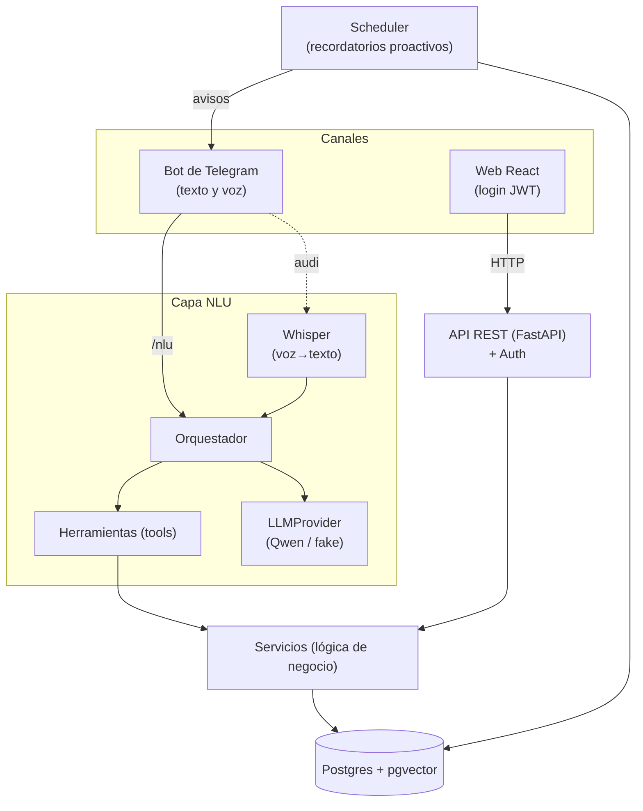
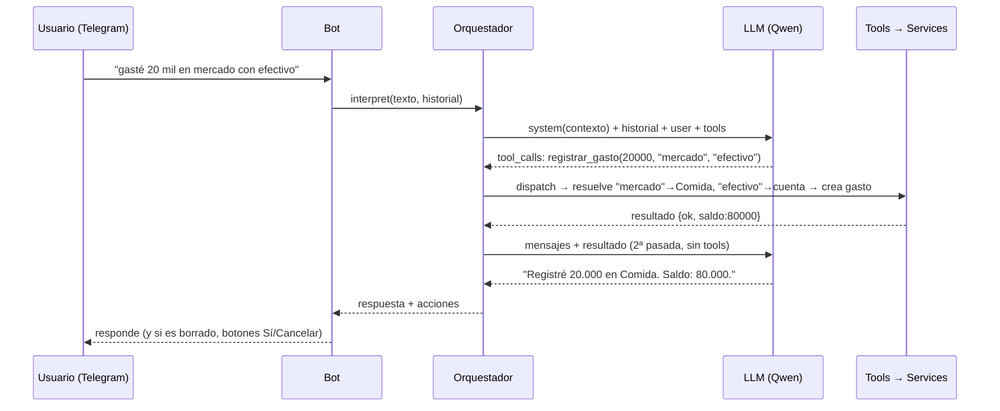

# Puiky — Arquitectura del agente (y por qué es fluido)

> Documento de referencia y enseñanza. Explica cómo está construido Puiky y, sobre
> todo, **qué decisiones de diseño hacen que su asistente conversacional se sienta
> fluido** — no solo que "funcione". Escrito a partir del código real (`backend/`).

---

## 1. Qué es Puiky

Un asistente personal ("segundo cerebro") de **un solo usuario**. Guarda notas,
tareas, proyectos, finanzas, responsabilidades y recordatorios. Se opera de dos
formas sobre **los mismos datos**: hablándole por **Telegram** (texto o voz) y por
una **interfaz web**. Un **scheduler** avisa de forma proactiva.

La pieza diferenciadora es la **capa NLU**: convierte lenguaje natural
("en la hoja de la reunión de hoy añade que definimos el hosting") en llamadas
concretas a operaciones de negocio, de forma que se sienta como hablarle a una
persona, no como llenar un formulario.

---

## 2. Arquitectura por capas

**Regla de oro:** el canal (Telegram) y el modelo (Qwen) son **reemplazables** sin
tocar el resto. La lógica de negocio vive en **una sola capa** (`services/`) que
usan por igual la API web, las tools del bot y el scheduler. Nada de lógica
duplicada por canal.

- **Datos/API** — FastAPI + SQLAlchemy + Alembic; Postgres con `pgvector` para
  búsqueda semántica de notas. Expone operaciones concretas (crear nota, registrar
  gasto, mover proyecto…).
- **NLU** — un LLM con *tool calling* mapea lenguaje natural a esas operaciones;
  Whisper transcribe la voz.
- **Canal** — bot de Telegram (long-polling, sin puertos abiertos).
- **Scheduler** — proceso aparte que revisa vencimientos y avisa.
- **Web** — React + Tailwind, cliente de la misma API.

---

## 3. El corazón: cómo un mensaje se vuelve acciones

Para **voz**, el bot primero transcribe con Whisper y luego sigue el mismo flujo con
el texto. La memoria de conversación se envía en cada llamada (ver §4.4).

---

## 4. Las decisiones que hacen fluido al agente

Esto es lo importante. Un agente "funciona" con solo exponer tools; se siente
**fluido** por estas decisiones. Cada una incluye el **anti-patrón** que evita.

### 4.1 Las tools son operaciones reales, no un CRUD genérico
Cada herramienta refleja una **intención del usuario** (`registrar_gasto`,
`anadir_a_hoja`, `cumplir_responsabilidad`), no `insertar_fila(tabla, datos)`.
- **Por qué:** el modelo elige mucho mejor entre verbos con significado que entre
  operaciones abstractas; y cada tool encapsula sus reglas (validaciones, efectos).
- **Anti-patrón:** exponer la base de datos cruda o un único `ejecutar_sql`. El
  modelo se pierde y hace cosas peligrosas.
- **Código:** `app/nlu/tools.py` (54 tools), cada una con `handler` → `services/`.

### 4.2 Referencias por nombre/semántica, nunca por ID
El usuario dice "la tarea del informe", "la cuenta de ahorros", "la hoja de la
reunión". Las tools **resuelven** eso a un id internamente (por `ilike` sobre el
título/nombre, o por búsqueda semántica en notas), y si hay ambigüedad **preguntan
cuál**.
- **Por qué:** nadie habla con UUIDs. Sin esto, el agente es inusable para editar
  cosas existentes.
- **Anti-patrón:** que la tool pida un `id`. El modelo lo inventa o falla.
- **Código:** `_resolver_tarea`, `_resolver_hoja`, `_resolver_cuenta`, … en
  `tools.py`. Devuelven error legible si no encuentran o si hay varios.

### 4.3 Inyección de contexto en el system prompt
Antes de cada interpretación, el prompt incluye **el estado volátil relevante**:
fecha/hora actual (para "mañana", "el viernes"), y las **listas** de cuadernos,
portafolios, categorías, cuentas y proyectos del usuario.
- **Por qué:** así el modelo mapea "mercado"→categoría *Comida*, "efectivo"→la
  cuenta real, y "mañana"→fecha ISO **sin preguntar**. Menos fricción, menos
  alucinación.
- **Anti-patrón:** un system prompt estático. El modelo no sabe qué existe y
  pregunta todo o inventa nombres.
- **Código:** `app/nlu/orchestrator.py::_system_prompt(db)`.

### 4.4 Memoria de conversación (multi-turno)
El bot guarda los últimos turnos por chat y los envía en cada petición. Así, cuando
el agente pregunta "¿cuál de los dos ítems?", la respuesta del usuario **tiene
contexto**.
- **Por qué:** sin memoria, cada mensaje se interpreta de cero; las aclaraciones se
  malinterpretan (p. ej. "bórralo" se rutea a la tool equivocada).
- **Anti-patrón:** agente stateless. Rompe cualquier diálogo de dos pasos.
- **Código:** `InterpretRequest.historial`; el bot lo mantiene en
  `context.chat_data` (`app/bot/handlers.py`), el orquestador lo antepone.

### 4.5 Los errores se devuelven como resultado, no como excepción
Si una tool falla (categoría inexistente, cuenta ambigua), devuelve
`{"ok": false, "error": "..."}` en vez de reventar. El modelo **lee ese error** y
se lo explica al usuario en lenguaje natural (o pide el dato que falta).
- **Por qué:** convierte fallos en conversación ("no encontré esa categoría, ¿creo
  una?") en vez de un "error 500".
- **Anti-patrón:** dejar que las excepciones maten el turno.
- **Código:** `tools.py::dispatch` captura `ValueError/KeyError` → resultado.

### 4.6 Confirmación de acciones destructivas
Las tools de borrado **no borran**: devuelven una petición de confirmación
`{"confirmar": {tipo, id, que}}`. El bot muestra botones **Sí/Cancelar**; solo al
tocar "Sí" se borra (vía la API, no vía el modelo).
- **Por qué:** un LLM no debe borrar datos por su cuenta a partir de una frase
  ambigua. Seguridad + confianza.
- **Anti-patrón:** ejecutar el borrado directo desde el tool call.
- **Código:** `_eliminar_*` en `tools.py` (payload `confirmar`);
  `handlers.on_callback` + botones inline; borra con `client.delete_entity`.

### 4.7 Proveedor y modelo intercambiables (real / fake)
`LLMProvider` es una interfaz con dos implementaciones: **real** (endpoint
OpenAI-compatible → Ollama/Qwen) y **fake** (intérprete determinista por reglas).
Lo mismo para Whisper (real/fake) y embeddings (real/fake).
- **Por qué:** se desarrolla y testea **sin** el modelo (rápido, barato, offline), y
  en producción se cambia con una variable de entorno. También permite enrutar
  casos difíciles a un modelo más capaz sin reescribir nada.
- **Anti-patrón:** acoplar el código a un SDK/modelo concreto.
- **Código:** `app/nlu/provider.py`, `transcriber.py`, `embeddings.py`.

### 4.8 Orquestación: una ronda de tools + confirmación natural
El orquestador hace **una** ronda: pide al modelo qué hacer, ejecuta las tools
(pueden ser varias — multi-intención), y hace una **segunda llamada sin tools** solo
para que redacte la confirmación en lenguaje natural con los resultados reales.
- **Por qué:** evita bucles de tools infinitos y da respuestas naturales basadas en
  lo que **de verdad** pasó (saldos, ids), no en lo que el modelo "cree".
- **Anti-patrón:** dejar al modelo iterar sin límite, o narrar sin ver resultados.
- **Código:** `app/nlu/orchestrator.py::interpret`.

---

## 5. Componentes en detalle

**NLU (`app/nlu/`)**
- `provider.py` — `LLMProvider` (real/fake) y el tipo `LLMResponse`/`ToolCall`.
- `tools.py` — 54 tools: esquema (para el modelo) + `handler` (resuelve referencias
  y llama a `services/`). `dispatch()` ejecuta y captura errores.
- `orchestrator.py` — construye el prompt con contexto, corre la ronda de tools y la
  segunda pasada; recibe el `historial`.
- `transcriber.py` — Whisper (faster-whisper) real/fake.

**Canal (`app/bot/`)**
- `main.py` — arranca el bot (long-polling); registra handlers.
- `handlers.py` — allowlist de IDs, memoria por chat, texto/voz, y el
  `CallbackQueryHandler` de los botones de confirmación.
- `client.py` — cliente HTTP a la API (usa un **token de servicio**, no el login
  humano).

**Scheduler (`app/scheduler/`)** — bucle que genera avisos escalonados de
vencimientos, alertas de presupuesto, y entrega recordatorios con insistencia.

**Datos** — `models/` (SQLAlchemy), `services/` (lógica), `routers/` (HTTP),
`alembic/` (migraciones), auth con JWT (usuario web) + token de servicio (bot).

---

## 6. Checklist para hacer un agente fluido (replicable)

1. **Verbos, no CRUD.** Define tools por intención del usuario.
2. **Resuelve referencias por nombre/semántica.** Nunca pidas IDs.
3. **Desambigua.** Si hay varios candidatos, pregunta cuál.
4. **Inyecta contexto** (fecha + qué existe: nombres de sus cosas) en el prompt.
5. **Da memoria** de conversación (aunque sean pocos turnos).
6. **Errores como datos**, no como excepciones: el modelo los explica.
7. **Confirma lo destructivo** fuera del modelo (botones/segundo paso).
8. **Una ronda de tools + respuesta con resultados reales.**
9. **Abstrae el modelo** (interfaz + fake) para desarrollar sin depender de él.
10. **No preguntes lo que ya se dijo** (dilo en el prompt) y **responde breve**.

Estos diez puntos son la diferencia entre "un agente que llama funciones" y "un
asistente que se siente natural".

---

## 7. Stack e infraestructura

- **Backend/NLU:** Python, FastAPI, SQLAlchemy, Alembic; deps con `uv`.
- **BD:** Postgres + `pgvector`. Embeddings: `multilingual-e5-base` (768 dims).
- **Modelo:** Qwen3 14B local vía **Ollama** (endpoint OpenAI-compatible).
  Transcripción: Whisper. Ambos intercambiables por variable de entorno.
- **Canal:** Telegram Bot API (long-polling → sin IP pública ni puertos abiertos).
- **Web:** React + Vite + TypeScript + Tailwind; auth JWT.
- **Orquestación:** Docker Compose (Postgres, app, bot, scheduler). Desarrollo en
  Windows, ejecución en Ubuntu; el código es idéntico (todo config por `.env`).
- **Seguridad:** dos tipos de llamante — usuario web (JWT tras login) y bot
  (token de servicio interno). Telegram se protege con allowlist de IDs.

---

## 8. Por qué "el otro agente" no fluye igual

Si un agente parecido no se siente fluido, casi siempre falta uno de estos:
- Pide **IDs** o datos que el usuario no tiene a mano (falta §4.2/§4.3).
- Es **stateless** y pierde el hilo en cuanto hay una aclaración (falta §4.4).
- Sus tools son **genéricas** o demasiadas sin buenas descripciones (falta §4.1).
- **Revienta** ante un fallo en vez de convertirlo en diálogo (falta §4.5).
- El prompt no le dice **qué existe**, así que pregunta todo o inventa (falta §4.3).

La fluidez no viene del modelo; viene de **cómo se le da el contexto, cómo se
resuelven las referencias y cómo se maneja el error y la memoria**.
