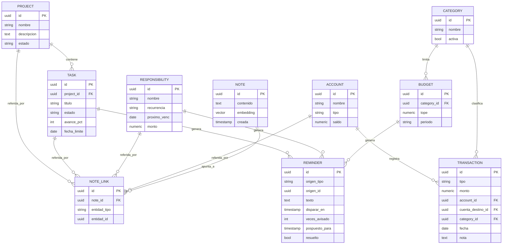

# Puiky — Modelo de datos (Fase 0)

> Documento de referencia del modelo de datos. Última actualización: junio 2026.
> Base: Postgres con la extensión `pgvector`. Identificadores `uuid`.

## Entidades

### PROJECT
Agrupa tareas y puede ser referido por notas.
- `id` (uuid, PK)
- `nombre` (string)
- `descripcion` (text)
- `estado` (activo / pausado / terminado)

### TASK
- `id` (uuid, PK)
- `project_id` (uuid, FK → PROJECT, opcional)
- `titulo` (string)
- `estado` (planeada / en ejecución / en pausa / terminada) — los cuatro estados
  son las columnas del tablero Kanban
- `avance_pct` (int)
- `fecha_limite` (date, opcional)

### NOTE
El núcleo del sistema (segundo cerebro).
- `id` (uuid, PK)
- `contenido` (text)
- `embedding` (vector pgvector, para búsqueda semántica)
- `creada` (timestamp)

### NOTE_LINK
Tabla de vínculos polimórficos. Permite que **una nota se vincule a varias cosas a
la vez**. Es la base para, más adelante, "pintar relaciones entre cosas" estilo
Obsidian.
- `id` (uuid, PK)
- `note_id` (uuid, FK → NOTE)
- `entidad_tipo` (project / task / responsibility / account)
- `entidad_id` (uuid — apunta a la entidad correspondiente según `entidad_tipo`)

### RESPONSIBILITY
Compromisos recurrentes (arriendo, renovaciones).
- `id` (uuid, PK)
- `nombre` (string)
- `recurrencia` (p. ej. mensual / anual / cada N días)
- `proximo_venc` (date) — se recalcula al marcar como cumplida
- `monto` (numeric, opcional)

### REMINDER
Cubre recordatorios **atados** (con origen) y **sueltos** (sin origen, p. ej.
"recuérdame llamar a Juan el viernes"). Los campos de conteo, posposición y
resolución habilitan los avisos escalonados e insistentes del scheduler.
- `id` (uuid, PK)
- `origen_tipo` (task / responsibility / budget, **opcional**)
- `origen_id` (uuid, opcional)
- `texto` (text)
- `disparar_en` (timestamp)
- `veces_avisado` (int)
- `pospuesto_para` (timestamp, opcional)
- `resuelto` (bool)

### ACCOUNT
La cuenta de ahorros es una cuenta normal más.
- `id` (uuid, PK)
- `nombre` (string)
- `tipo` (efectivo / banco / ahorros / …)
- `saldo` (numeric)

### CATEGORY
Categorías fijas pero extensibles.
- `id` (uuid, PK)
- `nombre` (string)
- `activa` (bool)

### TRANSACTION
El campo `tipo` permite **excluir las transferencias de los reportes de gasto**:
una transferencia mueve saldo entre dos cuentas propias pero no es gasto real.
- `id` (uuid, PK)
- `tipo` (gasto / ingreso / transferencia)
- `monto` (numeric)
- `account_id` (uuid, FK → ACCOUNT — cuenta origen)
- `cuenta_destino_id` (uuid, FK → ACCOUNT — solo en transferencias)
- `category_id` (uuid, FK → CATEGORY)
- `fecha` (date)
- `nota` (text)

### BUDGET
Si `category_id` está lleno, es un presupuesto por categoría ("máx. 500 en
comida"); si va vacío, es el **presupuesto global del mes**. Permite **transitar
gradualmente** de un único tope global (uso actual) a un control detallado por
categoría, e incluso combinarlos. Genera recordatorios de alerta (p. ej. al 90%).
- `id` (uuid, PK)
- `category_id` (uuid, FK → CATEGORY, **opcional**)
- `tope` (numeric)
- `periodo` (string, p. ej. mensual)

### USER
Para el login de la interfaz web (fase posterior). Sistema de un solo usuario, pero
la interfaz estará expuesta y requiere autenticación. Contraseña siempre como hash.
- `id` (uuid, PK)
- `usuario` (string)
- `password_hash` (string)
- `creado` (timestamp)

> **Acceso desde Telegram (no es entidad):** el bot y la API corren en el mismo
> servidor. No usan el login de USER. Opciones a decidir en su fase: (a) API solo
> en `localhost`; (b) credencial de servicio interna (token en variable de entorno)
> distinta del token de sesión del usuario web. La identidad del humano en Telegram
> ya la garantiza la allowlist de IDs del propio bot.

## Relaciones principales

- PROJECT 1—N TASK
- NOTE 1—N NOTE_LINK; cada NOTE_LINK referencia (polimórfico) a PROJECT / TASK /
  RESPONSIBILITY / ACCOUNT
- TASK / RESPONSIBILITY / BUDGET 1—N REMINDER (origen opcional)
- ACCOUNT 1—N TRANSACTION (como cuenta origen); las transferencias usan además
  `cuenta_destino_id`
- CATEGORY 1—N TRANSACTION; CATEGORY 1—N BUDGET (relación opcional)

## Decisiones de modelado tomadas

- **Transferencia = una sola fila** de tipo `transferencia` con cuenta origen y
  destino (no dos filas espejo). Suficiente para uso personal.
- **Presupuesto con categoría opcional**: soporta global y por categoría a la vez,
  con tránsito gradual del uno al otro.
- **Etiquetas pospuestas**: cuando se añadan, entran como una tabla `TAG` más una
  tabla de vínculo análoga a `NOTE_LINK`, sin alterar lo existente.

## Diagrama entidad-relación (Mermaid)

